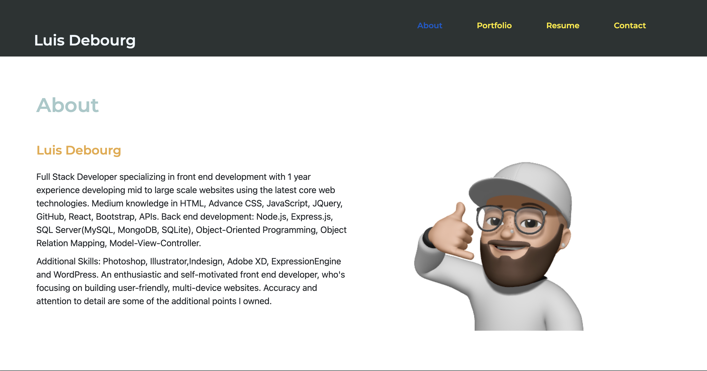
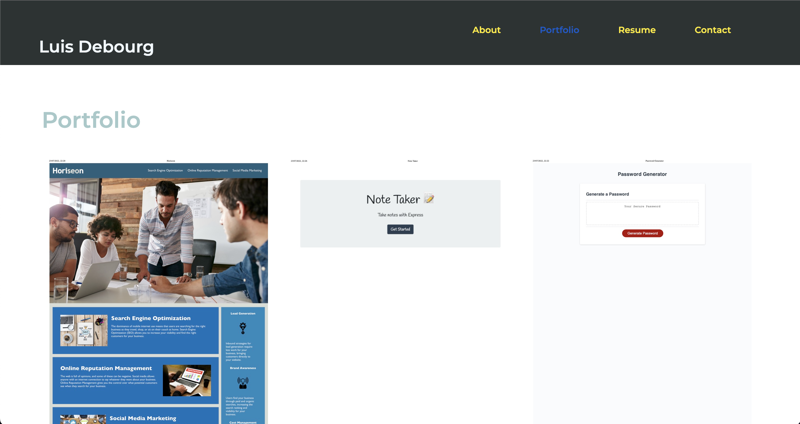
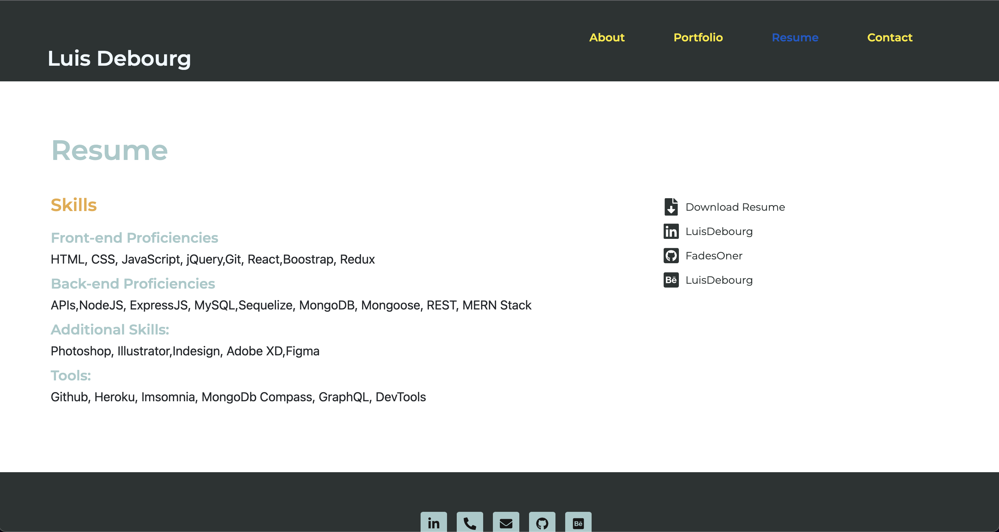
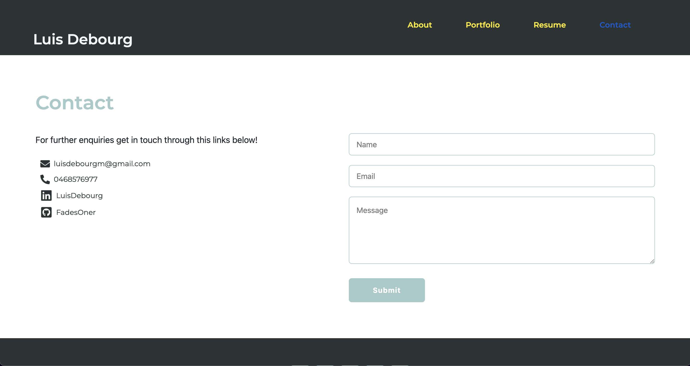

# React-Portfolio

- Github
  https://github.com/FadesOner/React-Porfolio
- Deploy link
  https://fadesoner.github.io/React-Porfolio/

# Description

a Portfolio using React.js, contains links to all my work during the bootcamp, aswell as the links to my linkedin, behance and github repos

# Table of contents
- Description
- Instalation
- Preview
- Usage
- License
- Technologies
- Contact

# Instalation

The following dependencies must be install in order for the app to work :  , , Express,react-boostrap, react-icons,gh-pages,web-vitals
You will also need Node.js
to start the server you need to npm start.

# Preview

# Usage

Firstly you have to creat the react app using npx create-react-app
then run the build using npm run build. http://localhost:3000/ to see the progress of your website before it is deployed.

# License

This project is not licensed.

# Technologies

- JavaScript
- Node.js
- react-boostrap
- react-icons
- Css
- gh-pages

# Contact

This was created by https://github.com/FadesOner, if you have any enquiry do not hesitate to emailing me at: luisdebourgm@gmail.com
